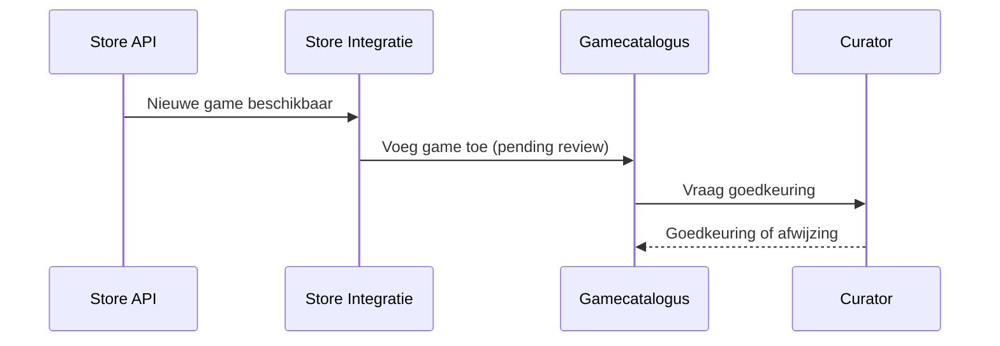
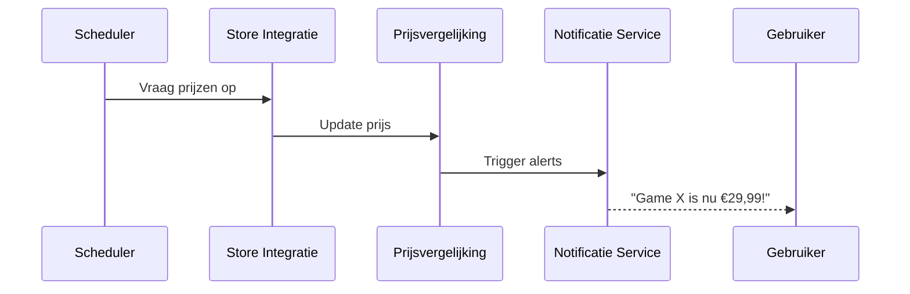
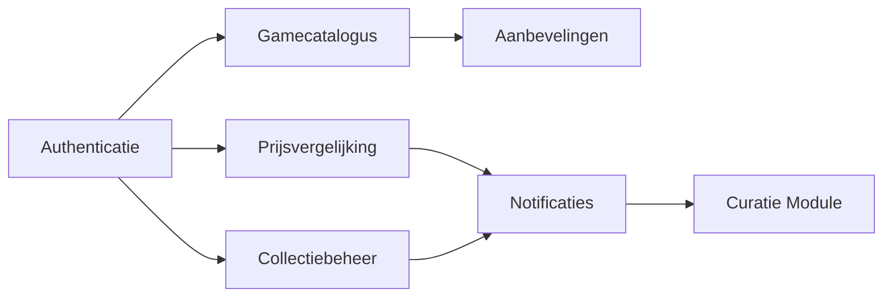

# Project ICT Architecture: Meta-winkel voor Games

## 1. Inleiding

Samen met twee vrienden sta ik op het punt om af te studeren in een ICT-richting. In plaats van meteen te gaan solliciteren, willen we een eigen project opstarten dat aansluit bij onze gedeelde passie: gamen. Na een uitgebreide brainstorm kwamen we tot het idee om een “meta-winkel” te bouwen die games centraliseert vanuit verschillende online winkels. Het systeem moet gebruikers toelaten om prijzen te vergelijken, hun collectie bij te houden, nieuwe titels te ontdekken en meldingen te ontvangen bij aanbiedingen.

Ons platform zal ondersteuning bieden voor meerdere platformen zoals PC, PlayStation, Xbox en Nintendo. Gebruikers kunnen aangeven welke platformen en winkels voor hen relevant zijn. De applicatie verwerkt data afkomstig van bestaande game-winkels en toont informatie over huidige én toekomstige releases. Daarnaast kunnen gebruikers zelf informatie aanleveren, zoals screenshots of ratings, die door curatoren worden goedgekeurd.

In deze documentatie beschrijf ik de architectuur van het systeem. Ik werk zowel een monolithische als een microservice-gebaseerde benadering uit, analyseer de belangrijkste systeemkarakteristieken, stel ADR's (Architectural Decision Records) op, en geef een overzicht van de logische en fysieke architecturen. Verder maak ik ook een proof-of-concept van de microservice-benadering, gehost in Kubernetes, inclusief authenticatie, monitoring en resilience.

Doel is om tot een schaalbare, onderhoudbare en veilige oplossing te bekomen die klaar is voor verdere ontwikkeling na deze eerste fase.

---

## 2. Karakteristieken en Driving Characteristics

### Belangrijke Karakteristieken

#### 1. **Schaalbaarheid (Scalability)**
Het systeem moet kunnen meegroeien met het aantal gebruikers en de toename van games en platformen. Zeker tijdens periodes van kortingen of populaire releases kunnen veel gebruikers gelijktijdig het systeem gebruiken.

#### 2. **Beschikbaarheid (Availability)**
Gebruikers willen op elk moment hun collectie kunnen raadplegen of prijzen vergelijken. Daarom moet het systeem hoge beschikbaarheid garanderen, zelfs bij gedeeltelijke uitval van externe winkels of services.

#### 3. **Veerkracht (Resilience)**
Omdat het systeem afhankelijk is van externe API’s (Steam, PlayStation Store, enz.), moet het robuust kunnen omgaan met fouten, time-outs en inconsistente data.

#### 4. **Modulariteit**
Door het aantal functies (collectiebeheer, aanbevelingen, prijsalerts, store-koppelingen...) is het belangrijk om het systeem modulair op te bouwen zodat toekomstige uitbreiding makkelijk blijft.

#### 5. **Onderhoudbaarheid (Maintainability)**
Het systeem zal continu aangepast moeten worden naarmate nieuwe winkels, platformen of game-functionaliteiten opduiken. Een duidelijke structuur en goed gedocumenteerde code zijn cruciaal.

#### 6. **Performance**
Prijsvergelijking en aanbevelingen moeten vlot verlopen. Gebruikers verwachten snelle laadtijden, zeker op mobiele toestellen of consoles.

#### 7. **Security & Authenticatie**
Gebruikers koppelen hun accounts aan externe platformen en beheren persoonlijke collecties. Authenticatie en veilige opslag van data zijn essentieel.

---

### Driving Characteristics

- **Veerkracht (Resilience)**
De afhankelijkheid van externe API’s vereist een architectuur die fouten lokaal kan afhandelen zonder het hele systeem onderuit te halen. Denk aan retries, caching, timeouts, of fallbacks.

- **Schaalbaarheid**
Als het systeem populair wordt (bijvoorbeeld via virale bekendheid of partnerschappen), moet het kunnen meegroeien zonder herbouw. Dit beïnvloedt onze keuze voor een microservice-architectuur op termijn.

- **Security**
Omdat gebruikers data van externe platformen koppelen, ratings geven en persoonlijke info beheren, moet veiligheid van data en authenticatie van gebruikers correct gebeuren vanaf de start.

---

## 3. Logische Componenten

Voor dit systeem gebruiken we een combinatie van **actor/action approach** en **workflow approach**, omdat er zowel veel interactie is tussen gebruikers en het systeem als achterliggende processen die zelfstandig lopen (zoals prijsupdating, aanbevelingen genereren, etc.).

### Actoren en hun acties

| Actor        | Acties                                                                 |
|--------------|------------------------------------------------------------------------|
| **Gebruiker** | - Registreren / Inloggen - Games beoordelen - Collectie beheren (manueel of gekoppeld) - Store voorkeuren instellen - Notificaties instellen bij aanbiedingen - Aanbevelingen raadplegen |
| **Curator**   | - Dubbele of irrelevante games verwijderen - Screenshots goedkeuren van gebruikers - Metadata beheren |
| **Publisher** | - Promo-informatie en trailers uploaden - Eigen games beheren |
| **Systeem**   | - Prijzen ophalen - Nieuwe games detecteren - Sales in de verf zetten - Games taggen op basis van inhoud - Aanbevelingen genereren obv gebruikersgedrag |

### Logische Componenten (Services/Modules)

- **Authenticatie & Gebruikersbeheer**
  - Beheert login, gebruikersrollen
- **Gamecatalogus**
  - Opslag en weergave van alle games met metadata
- **Prijsvergelijking**
  - Houdt actuele prijzen en prijsgeschiedenis bij
- **Collectiebeheer**
  - Persoonlijke gamecollecties, import van externe platforms
- **Media & Reviews**
  - Beheren van screenshots, trailers en gebruikersratings
- **Aanbevelingssysteem**
  - Algoritme dat suggesties doet op basis van data
- **Notificatie Service**
  - Waarschuwt gebruikers bij deals, nieuwe games of aanbevelingen
- **Store Integratie**
  - API-koppelingen met winkels zoals Steam, PS Store, etc.
- **Curatie Module**
  - Goedkeuren/verwerpen van content, beheer van shovelware
- **Monitoring & Telemetrie**
  - Logging, metrics, systeemstatus

### Workflows

#### 1. Game wordt toegevoegd aan het systeem

#### 2. Prijswijziging verwerken

## 4. Monolithische Architectuur

### Monolithische Stijl: Keuze en Verantwoording
Een monolithische architectuur heeft de voorkeur voor de eerste versie van het systeem vanwege de eenvoud in de ontwikkeling, het onderhoud en de integratie van verschillende onderdelen. De monolithische aanpak maakt het mogelijk om snel een prototype te bouwen zonder de overhead van meerdere microservices, en biedt voordelen op het gebied van eenvoudiger testen, deployment en communicatie tussen de modules.

#### Voordelen:
- **Snelle ontwikkeling**: Omdat alle componenten in één applicatie zitten, is het makkelijker om snel nieuwe functies te ontwikkelen en te testen.
- **Eenvoudig testen**: Aangezien de modules al dicht bij elkaar draaien, kunnen ze eenvoudiger worden getest zonder dat er uitgebreide inter-service communicatie nodig is.
- **Eenvoudig deployment**: Je hoeft slechts één applicatie te deployen in plaats van meerdere microservices.
- **Minder complexiteit**: Er is geen complexe netwerkcommunicatie of API-gateway nodig voor het communiceren tussen microservices.

#### Nadelen:
- **Beperkingen bij schaalbaarheid**: Naarmate het aantal gebruikers toeneemt, kan het moeilijker worden om de monolithische applicatie efficiënt te schalen.
- **Moeilijker onderhoud op lange termijn**: Als de applicatie groeit, kan het steeds lastiger worden om het geheel overzichtelijk en beheersbaar te houden.
- **Beperkingen in technologiekeuze**: Alle componenten moeten dezelfde technologie stack gebruiken, wat flexibiliteit in technologiebeperkingen kan verminderen.

---

### Mapping logische → fysieke architectuur

In de monolithische architectuur worden de logische componenten van het systeem geïmplementeerd als één enkele applicatie die op een server draait. De volgende mapping wordt gebruikt:

| Logische Component    | Fysieke Implementatie                                  |
|-----------------------|--------------------------------------------------------|
| **Authenticatie**      | Wordt in dezelfde applicatie behandeld met OAuth integratie. |
| **Gamecatalogus**      | Eén database wordt gebruikt voor het opslaan van game-informatie en metadata. |
| **Prijsvergelijking**  | Integratie van externe APIs binnen dezelfde serveromgeving om prijzen op te halen. |
| **Collectiebeheer**    | Gebruikers kunnen hun collectie beheren binnen één enkele database. |
| **Aanbevelingen**      | Implementatie van aanbevelingsalgoritmes binnen de monolithische applicatie zelf. |
| **Notificaties**       | De notificatiediensten worden geïmplementeerd als een intern systeem zonder aparte microservice. |
| **Curatie Module**     | Administratie wordt beheerd binnen dezelfde applicatie en toegangscontrole via beheerderrollen. |

#### Mermaid-diagram

## 5. Microservices Architectuur

### Opsplitsing in services

### Voor- en nadelen microservice-stijl

#### Voordelen:

#### Nadelen:

### ADR's (Architectural Decision Records)

- ADR 1:
- ADR 2:
- ADR 3:
- ADR 4:
- ADR 5:

## 6. Kubernetes Proof-of-Concept

- Microservices dummy setup
- Authenticatie
- Monitoring
- Resilience

## 7. Toelichting

- Reflectie
- Gebruikte tools
- Lessons learned

