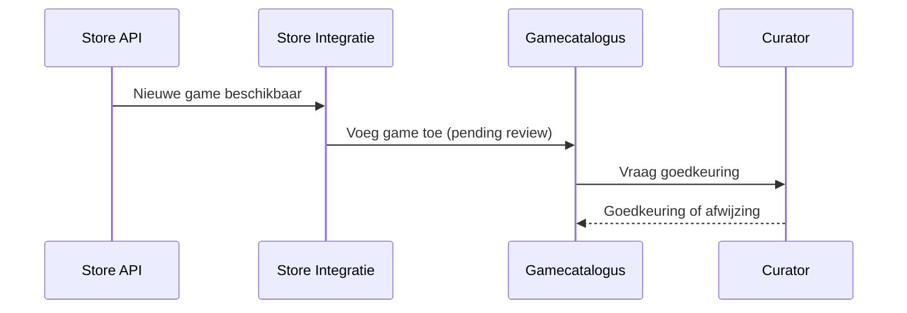
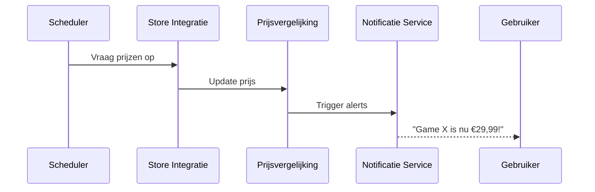
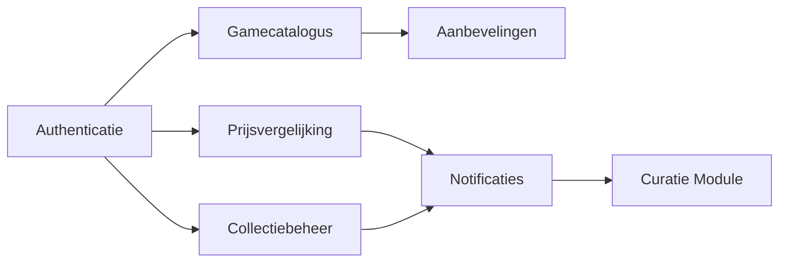

# Project ICT Architecture: Meta-winkel voor Games

# 1. Inleiding

Samen met twee vrienden sta ik op het punt om af te studeren in een ICT-richting. In plaats van meteen te gaan solliciteren, willen we een eigen project opstarten dat aansluit bij onze gedeelde passie: gamen. Na een uitgebreide brainstorm kwamen we tot het idee om een “meta-winkel” te bouwen die games centraliseert vanuit verschillende online winkels. Het systeem moet gebruikers toelaten om prijzen te vergelijken, hun collectie bij te houden, nieuwe titels te ontdekken en meldingen te ontvangen bij aanbiedingen.

Ons platform zal ondersteuning bieden voor meerdere platformen zoals PC, PlayStation, Xbox en Nintendo. Gebruikers kunnen aangeven welke platformen en winkels voor hen relevant zijn. De applicatie verwerkt data afkomstig van bestaande game-winkels en toont informatie over huidige én toekomstige releases. Daarnaast kunnen gebruikers zelf informatie aanleveren, zoals screenshots of ratings, die door curatoren worden goedgekeurd.

In deze documentatie beschrijf ik de architectuur van het systeem. Ik werk zowel een monolithische als een microservice-gebaseerde benadering uit, analyseer de belangrijkste systeemkarakteristieken, stel ADR's (Architectural Decision Records) op, en geef een overzicht van de logische en fysieke architecturen. Verder maak ik ook een proof-of-concept van de microservice-benadering, gehost in Kubernetes, inclusief authenticatie, monitoring en resilience.

Doel is om tot een schaalbare, onderhoudbare en veilige oplossing te bekomen die klaar is voor verdere ontwikkeling na deze eerste fase.

---

# 2. Karakteristieken en Driving Characteristics

### Belangrijke Karakteristieken

#### 1. **Schaalbaarheid (Scalability)**
Het systeem moet kunnen meegroeien met het aantal gebruikers en de toename van games en platformen. Zeker tijdens periodes van kortingen of populaire releases kunnen veel gebruikers gelijktijdig het systeem gebruiken.

#### 2. **Beschikbaarheid (Availability)**
Gebruikers willen op elk moment hun collectie kunnen raadplegen of prijzen vergelijken. Daarom moet het systeem hoge beschikbaarheid garanderen, zelfs bij gedeeltelijke uitval van externe winkels of services.

#### 3. **Veerkracht (Resilience)**
Omdat het systeem afhankelijk is van externe API’s (Steam, PlayStation Store, enz.), moet het robuust kunnen omgaan met fouten, time-outs en inconsistente data.

#### 4. **Modulariteit**
Door het aantal functies (collectiebeheer, aanbevelingen, prijsalerts, store-koppelingen...) is het belangrijk om het systeem modulair op te bouwen zodat toekomstige uitbreiding makkelijk blijft.

#### 5. **Onderhoudbaarheid (Maintainability)**
Het systeem zal continu aangepast moeten worden naarmate nieuwe winkels, platformen of game-functionaliteiten opduiken. Een duidelijke structuur en goed gedocumenteerde code zijn cruciaal.

#### 6. **Performance**
Prijsvergelijking en aanbevelingen moeten vlot verlopen. Gebruikers verwachten snelle laadtijden, zeker op mobiele toestellen of consoles.

#### 7. **Security & Authenticatie**
Gebruikers koppelen hun accounts aan externe platformen en beheren persoonlijke collecties. Authenticatie en veilige opslag van data zijn essentieel.

---

### Driving Characteristics

- **Veerkracht (Resilience)**
De afhankelijkheid van externe API’s vereist een architectuur die fouten lokaal kan afhandelen zonder het hele systeem onderuit te halen. Denk aan retries, caching, timeouts, of fallbacks.

- **Schaalbaarheid**
Als het systeem populair wordt (bijvoorbeeld via virale bekendheid of partnerschappen), moet het kunnen meegroeien zonder herbouw. Dit beïnvloedt onze keuze voor een microservice-architectuur op termijn.

- **Security**
Omdat gebruikers data van externe platformen koppelen, ratings geven en persoonlijke info beheren, moet veiligheid van data en authenticatie van gebruikers correct gebeuren vanaf de start.

---

# 3. Logische Componenten

Voor dit systeem gebruiken we een combinatie van **actor/action approach** en **workflow approach**, omdat er zowel veel interactie is tussen gebruikers en het systeem als achterliggende processen die zelfstandig lopen (zoals prijsupdating, aanbevelingen genereren, etc.).

### Actoren en hun acties

| Actor        | Acties                                                                 |
|--------------|------------------------------------------------------------------------|
| **Gebruiker** | - Registreren / Inloggen via OAuth<br>- Games beoordelen<br>- Collectie beheren (manueel of gekoppeld)<br>- Store voorkeuren instellen<br>- Notificaties instellen bij aanbiedingen<br>- Aanbevelingen raadplegen |
| **Curator**   | - Dubbele of irrelevante games verwijderen<br>- Screenshots goedkeuren van gebruikers<br>- Metadata beheren |
| **Publisher** | - Promo-informatie en trailers uploaden<br>- Eigen games beheren |
| **Systeem**   | - Prijzen ophalen<br>- Nieuwe games detecteren<br>- Sales in de verf zetten<br>- Games taggen op basis van inhoud<br>- Aanbevelingen genereren obv gebruikersgedrag |

### Logische Componenten (Services/Modules)

- **Authenticatie & Gebruikersbeheer**
  - Beheert login, OAuth, gebruikersrollen
- **Gamecatalogus**
  - Opslag en weergave van alle games met metadata
- **Prijsvergelijking**
  - Houdt actuele prijzen en prijsgeschiedenis bij
- **Collectiebeheer**
  - Persoonlijke gamecollecties, import van externe platforms
- **Media & Reviews**
  - Beheren van screenshots, trailers en gebruikersratings
- **Aanbevelingssysteem**
  - Algoritme dat suggesties doet op basis van data
- **Notificatie Service**
  - Waarschuwt gebruikers bij deals, nieuwe games of aanbevelingen
- **Store Integratie**
  - API-koppelingen met winkels zoals Steam, GOG, PS Store, etc.
- **Curatie Module**
  - Goedkeuren/verwerpen van content, beheer van shovelware
- **Monitoring & Telemetrie**
  - Logging, metrics, systeemstatus

### Workflows

#### 1. Game wordt toegevoegd aan het systeem

#### 2. Prijswijziging verwerken


# 4. Monolithische Architectuur

### Monolithische Stijl: Keuze en Verantwoording
Een monolithische architectuur heeft de voorkeur voor de eerste versie van het systeem vanwege de eenvoud in de ontwikkeling, het onderhoud en de integratie van verschillende onderdelen. De monolithische aanpak maakt het mogelijk om snel een prototype te bouwen zonder de overhead van meerdere microservices, en biedt voordelen op het gebied van eenvoudiger testen, deployment en communicatie tussen de modules.

#### Voordelen:
- **Snelle ontwikkeling**: Omdat alle componenten in één applicatie zitten, is het makkelijker om snel nieuwe functies te ontwikkelen en te testen.
- **Eenvoudig testen**: Aangezien de modules al dicht bij elkaar draaien, kunnen ze eenvoudiger worden getest zonder dat er uitgebreide inter-service communicatie nodig is.
- **Eenvoudig deployment**: Je hoeft slechts één applicatie te deployen in plaats van meerdere microservices.
- **Minder complexiteit**: Er is geen complexe netwerkcommunicatie of API-gateway nodig voor het communiceren tussen microservices.

#### Nadelen:
- **Beperkingen bij schaalbaarheid**: Naarmate het aantal gebruikers toeneemt, kan het moeilijker worden om de monolithische applicatie efficiënt te schalen.
- **Moeilijker onderhoud op lange termijn**: Als de applicatie groeit, kan het steeds lastiger worden om het geheel overzichtelijk en beheersbaar te houden.
- **Beperkingen in technologiekeuze**: Alle componenten moeten dezelfde technologie stack gebruiken, wat flexibiliteit in technologiebeperkingen kan verminderen.

---

### Mapping logische → fysieke architectuur

In de monolithische architectuur worden de logische componenten van het systeem geïmplementeerd als één enkele applicatie die op een server draait. De volgende mapping wordt gebruikt:

| Logische Component    | Fysieke Implementatie                                  |
|-----------------------|--------------------------------------------------------|
| **Authenticatie**      | Wordt in dezelfde applicatie behandeld met OAuth integratie. |
| **Gamecatalogus**      | Eén database wordt gebruikt voor het opslaan van game-informatie en metadata. |
| **Prijsvergelijking**  | Integratie van externe APIs binnen dezelfde serveromgeving om prijzen op te halen. |
| **Collectiebeheer**    | Gebruikers kunnen hun collectie beheren binnen één enkele database. |
| **Aanbevelingen**      | Implementatie van aanbevelingsalgoritmes binnen de monolithische applicatie zelf. |
| **Notificaties**       | De notificatiediensten worden geïmplementeerd als een intern systeem zonder aparte microservice. |
| **Curatie Module**     | Administratie wordt beheerd binnen dezelfde applicatie en toegangscontrole via beheerderrollen. |

#### Mermaid-diagram




# 5. Microservices Architectuur

### Opsplitsing in services
Een microservice-architectuur biedt de mogelijkheid om het systeem op te splitsen in meerdere onafhankelijke services. Dit kan schaalbaarheid, onderhoudbaarheid en flexibiliteit ten goede komen. De belangrijkste services die we overwegen in de microservice-aanpak zijn:

- **Authenticatie-service**: Deze service is verantwoordelijk voor het beheer van gebruikersidentiteit en autorisatie, bijvoorbeeld door gebruik te maken van OAuth voor externe logins.
- **Prijsvergelijking-service**: Deze service haalt prijzen op van verschillende online winkels en vergelijkt deze.
- **Gamecatalogus-service**: Deze service houdt de metadata van alle beschikbare games bij en biedt toegang tot game-informatie.
- **Notificatie-service**: Deze service verstuurt meldingen naar gebruikers over kortingen, aanbiedingen, of nieuwe games.
- **Collectiebeheer-service**: Beheert de persoonlijke collectie van de gebruiker, inclusief geïmporteerde games van verschillende platformen.
- **Curatie-service**: Deze service is verantwoordelijk voor het goedkeuren of afwijzen van nieuwe game-informatie of content van gebruikers.
- **Aanbeveling-service**: Deze service genereert aanbevelingen voor gebruikers op basis van hun gedrag en voorkeuren.

### Voor- en nadelen microservice-stijl

#### Voordelen:
- **Schaalbaarheid**: Elke service kan onafhankelijk worden geschaald afhankelijk van de behoefte. Bijvoorbeeld, de prijsvergelijkingsservice kan worden opgeschaald tijdens grote uitverkoopperioden.
- **Flexibiliteit in technologie**: Elke service kan de technologie gebruiken die het beste past bij de functionaliteit. Bijvoorbeeld, de authenticatieservice kan OAuth gebruiken, terwijl de prijsvergelijkingsservice Python-scripts gebruikt om prijzen op te halen.

- **Betere foutisolatie**: Als een microservice faalt, beïnvloedt dit niet direct de andere services. Dit maakt het systeem veerkrachtiger.

- **Snellere ontwikkeling en implementatie**: Teams kunnen onafhankelijk aan verschillende services werken, wat zorgt voor sneller itereren en sneller kunnen implementeren.

#### Nadelen:
- **Complexiteit**: Het beheer van meerdere microservices vereist veel meer infrastructuur, zoals service discovery, load balancing en API-gateways.

- **Netwerkcommunicatie**: Microservices communiceren via netwerken, wat extra latency en mogelijke problemen met netwerkfouten kan veroorzaken.

- **Data-consistentie**: Het behouden van data-consistentie tussen microservices kan complex zijn, omdat elke service zijn eigen database heeft.

- **Implementatiekosten**: De infrastructuur om meerdere microservices te beheren, zoals containers en orkestratieplatforms zoals Kubernetes, kan aanvankelijk kostbaar zijn.


### ADR's (Architectural Decision Records)

#### ADR 1: Gebruik van een monolithische architectuur in eerste implementatie
**Status**: Accepted

##### Context
De eerste versie van het systeem vereist nog veel iteratie en snelle veranderingen. Teams zijn klein, het domein is nog niet stabiel en ontwikkelsnelheid heeft prioriteit. Complexe netwerkcommunicatie, observability en CI/CD zijn momenteel nog niet ingericht.

##### Decision
We starten met een monolithische architectuur, waarbij alle logische componenten binnen één gedeelde applicatie draaien.

##### Consequences
- Snellere ontwikkelcyclus  
- Geen nood aan distributed tracing of netwerkdebugging  
- Beperkte schaalbaarheid per component  
- Lastiger refactoren zodra het domein groeit

##### Governance
We bewaken modulaire code-structuur binnen de monoliet via duidelijke package boundaries en CI-regels (zoals geen cross-domain imports).

##### Notes
Kan later opgesplitst worden in microservices zodra de modules stabieler zijn.

------

#### ADR 2: Gebruik van relationele database voor centrale opslag
**Status**: Accepted

##### Context
Het systeem bevat relaties tussen gebruikers, games, platformen en ratings. We verwachten frequente query's met joins en filters.

##### Decision
We gebruiken MongoDB als centrale relationele database voor zowel de monolithische als microservices-opstelling.

##### Consequences
- Sterke ondersteuning voor relaties en transacties  
- Bekende tooling en ondersteuning  
- Verticaal schaalbaar; minder geschikt voor hoge loads per microservice zonder partitionering

##### Governance
ERD wordt bijgehouden in versiebeheer, wijzigingen in datamodel vereisen review met impact-analyse.

##### Notes
Kan later worden opgesplitst in meerdere databases bij overstap naar microservices.

------

#### ADR 3: Prijsupdates via periodieke polling
**Status**: Accepted

##### Context
Externe API’s zoals Steam of GOG bieden geen event-driven integratie. We willen prijswijzigingen bijhouden maar niet blokkeren op API-beschikbaarheid.

##### Decision
We gebruiken een scheduler om dagelijks prijzen op te halen via polling.

##### Consequences
- Robuust tegen API-uitval  
- Eenvoudig te implementeren  
- Mogelijke vertraging in updates (afhankelijk van pollingfrequentie)  
- Niet real-time

##### Governance
Scheduler logs worden gemonitord en failures geven alerts in onze observability stack (bijv. Prometheus + Grafana).

##### Notes
Supersedes eerdere notie om real-time events via webhook te ontvangen (niet ondersteund door stores).

------

#### ADR 4: Microservices-architectuur voor schaalbaarheid en resilience
**Status**: Proposed

##### Context
Bij toenemende populariteit (bijv. via partnerschappen) willen we schaalbaarheid per functie en onafhankelijk kunnen deployen. De logische componenten zijn sterk gescheiden (prijsvergelijking, aanbevelingen, curatie...).

##### Decision
Voor de toekomstige versie schakelen we over naar een microservices-architectuur, waarbij elke module een eigen service wordt met eigen database (of schema).

##### Consequences
- Onafhankelijke schaalbaarheid per service  
- Betere foutisolatie en resilience  
- Hogere complexiteit in CI/CD en observability  
- Netwerk- en latency issues tussen services

##### Governance
Elke service heeft een eigen repo met duidelijke contracts (API en data). Versiebeheer en backward compatibility worden expliciet bewaakt.

##### Notes
Supersedes ADR-001 zodra we overstappen naar productie op schaal.

------

#### ADR 5: Gebruik van Kubernetes voor microservice deploys
**Status**: Proposed

##### Context
We willen een schaalbare en zelfherstellende omgeving voor onze microservices. Kubernetes is een industrieel standaardplatform dat automatische scaling, load balancing en monitoring ondersteunt.

##### Decision
Alle microservices worden gedeployed op een Kubernetes-cluster. We gebruiken Helm voor templating en namespaces voor domeinafscheiding.

##### Consequences
- Automatische scaling en resilience  
- Integratie met observability tooling zoals Prometheus  
- Initieel hogere leercurve  
- Meer infrastructuurbeheer

##### Governance
CI-pipeline pusht automatisch naar het cluster, policies worden via RBAC en PodSecurityEnforcement gehandhaafd. Alerts bij failures via Prometheus/Alertmanager.

##### Notes
Beheerd via cloud (GKE of AKS), met fallback naar lokaal (minikube) voor testing.


# 6. Kubernetes Proof-of-Concept

## Implementatie Overzicht

De microservices implementatie draait volledig op **Kubernetes** en demonstreert alle vereiste aspecten van de opdracht. Het systeem bestaat uit **vier hoofdservices** die elk een specifiek domein beheren.

## Service Architectuur

### Authentication Service

```javascript
// JWT-based authentication met bcrypt password hashing
const token = jwt.sign(
  { userId: user._id, email: user.email, username: user.username },
  process.env.JWT_SECRET || 'your-secret-key',
  { expiresIn: '24h' }
);
```

**Features:**

* User registratie en login
* JWT token generatie en validatie
* Password hashing met bcrypt
* Health checks op `/auth/health`
* Database connectiviteit monitoring

### Game Catalog Service

```javascript
// Dynamische game catalog met CRUD operaties
const gameSchema = new mongoose.Schema({
  _id: { type: String, required: true },
  title: { type: String, required: [true, 'Title is required'] },
  price: { type: Number, required: [true, 'Price is required'], min: [0.01, 'Price must be greater than 0'] },
  platforms: { type: [String], required: [true, 'At least one platform is required'] }
});
```

**Features:**

* CRUD operaties voor games
* Zoeken en filteren (genre, platform, zoekterm)
* Paginatie ondersteuning
* Input validatie en error handling
* Sample data initialisatie

### Price Comparison Service

```javascript
// Prijsvergelijking met store integratie
const PriceSchema = new mongoose.Schema({
  gameId: { type: String, required: true },
  store: { type: String, required: true },
  price: { type: Number, required: true },
  discount: { type: Boolean, default: false },
  originalPrice: Number,
  lastUpdated: { type: Date, default: Date.now }
});
```

**Features:**

* Multi-store prijsvergelijking
* Kortingen en originele prijzen tracking
* Best price algoritme
* Mock price history voor demonstratie
* Store-specifieke filtering

### Collection Management Service

```javascript
// Persoonlijke game collecties
const CollectionItemSchema = new mongoose.Schema({
  userId: { type: String, required: true },
  gameId: { type: String, required: true },
  status: { type: String, enum: ['wishlist', 'in-progress', 'completed', 'backlog'] },
  playtime: { type: Number, default: 0 },
  rating: { type: Number, min: 1, max: 5 }
});
```

**Features:**

* Persoonlijke game collecties per gebruiker
* Status tracking (wishlist, playing, completed, backlog)
* Playtime en rating systeem
* Collectie statistieken en analytics
* Bulk operaties voor collectie management

## Authenticatie Implementatie

### Kubernetes Secrets

```yaml
apiVersion: v1
kind: Secret
metadata:
  name: auth-secrets
  namespace: gameportal
type: Opaque
data:
  JWT_SECRET: eW91ci1zZWNyZXQta2V5  # Base64 encoded
```

### JWT Token Flow

* **Registratie/Login**: User credentials worden gevalideerd tegen MongoDB
* **Token Generatie**: JWT token met 24h expiry wordt aangemaakt
* **Token Distributie**: Client ontvangt token voor verdere authenticatie
* **Token Validatie**: Elke protected endpoint valideert de JWT token

### Database Security

```yaml
apiVersion: v1
kind: Secret
metadata:
  name: mongodb-secrets
  namespace: gameportal
data:
  MONGO_INITDB_ROOT_USERNAME: Z2FtZXBvcnRhbA==  # gameportal
  MONGO_INITDB_ROOT_PASSWORD: cGFzc3dvcmQxMjM=   # password123
```

## Monitoring Implementatie

### Prometheus Configuration

```yaml
global:
  scrape_interval: 15s

scrape_configs:
  - job_name: 'gameportal-services'
    static_configs:
      - targets:
        - 'authentication-svc.gameportal.svc.cluster.local:80'
        - 'game-catalog-svc.gameportal.svc.cluster.local:3000'
        - 'price-comparison-svc.gameportal.svc.cluster.local:80'
        - 'collection-management-service.gameportal.svc.cluster.local:80'
    metrics_path: '/health'
    scrape_interval: 30s
```

### Health Check Endpoints

```javascript
app.get('/auth/health', async (req, res) => {
  try {
    const dbState = mongoose.connection.readyState;
    if (dbState === 1) {
      await User.findOne().limit(1);
      res.json({
        status: 'healthy',
        database: 'connected',
        timestamp: new Date().toISOString()
      });
    } else {
      throw new Error('Database not connected');
    }
  } catch (error) {
    res.status(503).json({
      status: 'unhealthy',
      database: 'disconnected',
      error: error.message
    });
  }
});
```

### Grafana Dashboard

* Service Status
* Response Times
* Error Rates
* Database Connections
* Resource Usage

## Resilience Implementatie

### Horizontal Pod Autoscaling

```yaml
apiVersion: autoscaling/v2
kind: HorizontalPodAutoscaler
metadata:
  name: authentication-hpa
  namespace: gameportal
spec:
  scaleTargetRef:
    apiVersion: apps/v1
    kind: Deployment
    name: authentication
  minReplicas: 2
  maxReplicas: 4
  metrics:
  - type: Resource
    resource:
      name: cpu
      target:
        type: Utilization
        averageUtilization: 70
```

### Pod Disruption Budgets

```yaml
apiVersion: policy/v1
kind: PodDisruptionBudget
metadata:
  name: authentication-pdb
  namespace: gameportal
spec:
  minAvailable: 1
  selector:
    matchLabels:
      app: authentication
```

### Liveness en Readiness Probes

```yaml
livenessProbe:
  httpGet:
    path: /auth/health
    port: 3000
  initialDelaySeconds: 30
  periodSeconds: 10
  timeoutSeconds: 5
  failureThreshold: 3

readinessProbe:
  httpGet:
    path: /auth/health
    port: 3000
  initialDelaySeconds: 5
  periodSeconds: 5
  timeoutSeconds: 3
  failureThreshold: 3
```

### Rolling Update Strategy

```yaml
strategy:
  type: RollingUpdate
  rollingUpdate:
    maxUnavailable: 1
    maxSurge: 1
```

### Resource Limits en Requests

```yaml
resources:
  requests:
    memory: "128Mi"
    cpu: "100m"
  limits:
    memory: "256Mi"
    cpu: "200m"
```

## Service Communication

### Ingress Configuration

```yaml
spec:
  rules:
  - host: gameportal.local
    http:
      paths:
      - path: /auth
        pathType: Prefix
        backend:
          service:
            name: authentication-svc
            port:
              number: 80
      - path: /games
        pathType: Prefix
        backend:
          service:
            name: game-catalog-svc
            port:
              number: 3000
```

### Service Discovery

* `authentication-svc.gameportal.svc.cluster.local`
* `game-catalog-svc.gameportal.svc.cluster.local`
* `mongo-svc.gameportal.svc.cluster.local`

## Database Strategy

Alle services delen één MongoDB instance maar gebruiken verschillende collecties:

* **Authentication**: users collectie
* **Game Catalog**: games collectie
* **Price Comparison**: prices collectie
* **Collection Management**: collectionitems collectie

## Frontend Integration

```javascript
async function apiCall(service, endpoint, options = {}) {
  const headers = { 'Content-Type': 'application/json' };
  if (authToken && options.requireAuth !== false) {
    headers['Authorization'] = `Bearer ${authToken}`;
  }
  
  const url = `${SERVICES[service]}${endpoint}`;
  const response = await fetch(url, {
    ...options,
    headers: { ...headers, ...options.headers }
  });
  // Error handling en response parsing...
}
```

## Deployment en Operations

### Namespace Isolation

```yaml
apiVersion: v1
kind: Namespace
metadata:
  name: gameportal
  labels:
    name: gameportal
---
apiVersion: v1
kind: Namespace
metadata:
  name: monitoring
  labels:
    name: monitoring
```

### Storage Management

```yaml
apiVersion: v1
kind: PersistentVolumeClaim
metadata:
  name: mongodb-pvc
  namespace: gameportal
spec:
  storageClassName: standard
  accessModes:
    - ReadWriteOnce
  resources:
    requests:
      storage: 1Gi
```

## 7. Toelichting

### Reflectie op Architecturale Keuzes

#### Monolithische vs Microservices Trade-offs

**Voordelen Monolithisch:**

* Snelle prototyping
* Eenvoudige debugging
* Minder netwerklatency
* Transactionele consistentie

**Voordelen Microservices:**

* Onafhankelijke scaling
* Technology diversity
* Team autonomie
* Fault isolation

### Lessons Learned

1. **Kubernetes Leercurve**
2. **Monitoring is Cruciaal**
3. **Database Design Impact**
4. **Resilience Patterns zijn Complex**

### Gebruikte Tools en Technologieën

**Development Stack:** Node.js, Express, MongoDB, JWT, bcrypt
**Kubernetes Ecosystem:** Kubernetes, Docker, Nginx Ingress, Prometheus, Grafana
**Development Tools:** kubectl, Postman, Visual Studio Code, minikube

### Uitdagingen en Oplossingen

* **Service Discovery**: Kubernetes DNS-based service names
* **Configuration Management**: Secrets en ConfigMaps
* **Database Migrations**: Mongoose schema + init scripts
* **Inter-Service Communication**: HTTP + retry logic

### Wat Anders Zou Worden Gedaan

1. **Database per Service**: PostgreSQL, MongoDB, TimescaleDB
2. **Event-Driven Architecture**: RabbitMQ/Kafka, CQRS
3. **Advanced Resilience Patterns**: Circuit Breaker, Bulkhead, Retry
4. **Security Hardening**: OAuth2, API Gateway, Network Policies
5. **Observability Verbetering**: Tracing, Structured logging, Custom metrics

### Toekomstige Ontwikkelingen

* Externe API Integraties (Steam, PlayStation Store)
* Machine Learning aanbevelingen
* Mobile apps (iOS/Android)

## Conclusie

Dit project toont de complexiteit en voordelen van microservice architecturen. De keuze voor Kubernetes biedt schaalbaarheid en controle, maar vereist expertise. Een monoliet is geschikt voor een vroege fase; microservices passen beter bij groei en teamverdeling.
